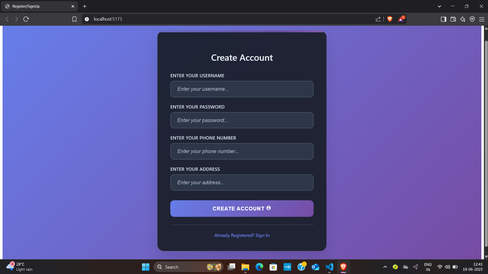
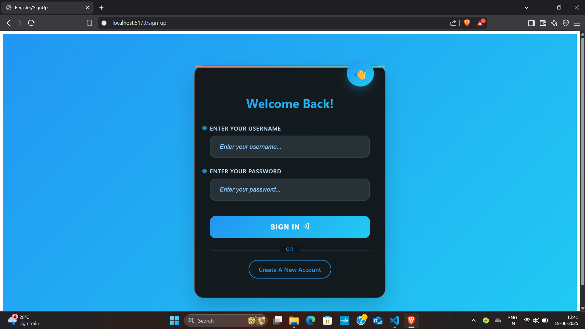
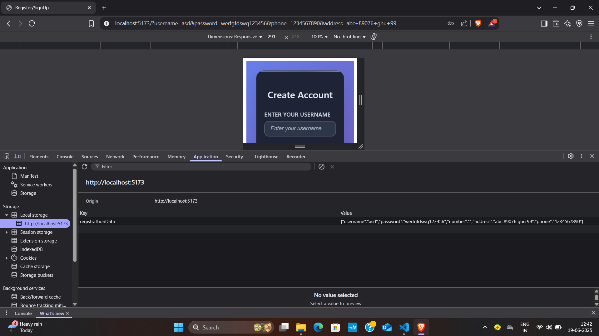

# React SignUp And Registration Page

This is a responsive and functional SignUp & Registration Page built with **React.js** and **Vite**. It uses **localStorage** to simulate user registration and login, making it ideal for UI prototyping or beginner practice.

### 🔗 Live Demo
👉 [View on GitHub Pages]( https://aayush45123.github.io/React-SignUp-And-Registration-Page/)

---

## ✨ Features

- 📄 User Registration Form
- 🔒 Sign-In/Login Form
- 🧠 LocalStorage-based mock authentication
- 🎨 Clean and responsive UI
- ⚛️ Built with React + Vite
- 🚀 Deployed on GitHub Pages

---

## 🛠️ Tech Stack

- **React.js**
- **Vite**
- **CSS Modules**
- **React Icons**

---

## 🧪 Setup Instructions

### 1. Clone the Repository
```bash
git clone https://github.com/aayush45123/College-Landing-Page-Somaiya.git
cd College-Landing-Page-Somaiya
```

### 2. Install Dependencies
```bash
npm install
```

### 3. Run Locally
```bash
npm run dev
```

---

## 🚀 Deployment to GitHub Pages

To deploy this Vite app to GitHub Pages:

### 1. Build the project
```bash
npm run build
```

### 2. Deploy to GitHub Pages
```bash
npm run deploy
```

Make sure your `package.json` includes:
```json
"homepage": "https://aayush45123.github.io/College-Landing-Page-Somaiya",
"scripts": {
  "predeploy": "npm run build",
  "deploy": "gh-pages -d dist"
}
```

And `vite.config.js` includes:
```js
base: '/College-Landing-Page-Somaiya/'
```

---

## 📁 Project Structure

```
src/
├── components/
│   ├── Registration.jsx
│   └── SignUp.jsx
├── styles/
│   ├── Registration.module.css
│   └── SignUp.module.css
├── App.jsx
├── main.jsx
vite.config.js
package.json
```

---

## 📷 Screenshots

### 📝 Registration Page


### 🔐 Sign In Page


### 💾 Data in localStorage



---

## 🙋‍♂️ Author

**Aayush Bharda**  
[GitHub: @aayush45123](https://github.com/aayush45123)

---

## 📃 License

This project is licensed under the MIT License.
